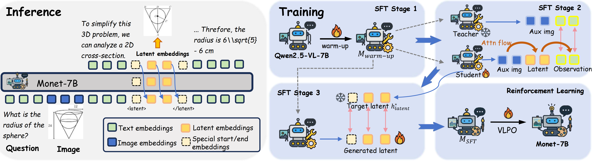

<p align="center">
  <h1 align="center">Monet: Reasoning in Latent Visual Space Beyond Images and Language</h1>
  <p align="center">
  </p>
  <p align="center">
    <a href="https://novaglow646.github.io/">Qixun Wang</a>,
    <a href="https://frankyang-17.github.io/">Yang Shi</a>,
    <a href="https://yifeiwang77.com/">Yifei Wang</a>,
    <a href="https://scholar.google.com/citations?user=COdftTMAAAAJ&hl=en">Yuanxing Zhang</a>,
    <a href="https://magicwpf.github.io/">Pengfei Wan</a>,
    <a href="https://scholar.google.com/citations?user=PXO4ygEAAAAJ&hl=zh-CN">Kun Gai</a>,
    <a href="https://scholar.google.com/citations?user=27o9L1wAAAAJ&hl=en">Xianghua Ying</a>,
    <a href="https://yisenwang.github.io/">Yisen Wang</a>
  </p>
  <p align="center">
    <a href="http://arxiv.org/abs/2511.21395">
      
    </a>
    <a href="https://huggingface.co/NOVAglow646/Monet-7B" target="_blank" rel="noopener noreferrer">
      
    </a>
    <a href="https://huggingface.co/datasets/NOVAglow646/Monet-SFT-125K" target="_blank">
    
    </a>

  </p>
</p>


<p align="center">
    
</p>
We introduce <b>Monet</b>, a training framework that enables multimodal large language models (MLLMs) to reason directly within the latent visual space by generating continuous embeddings that function as intermediate visual thoughts. 
<br>

## 🔥Updates:
* 2025.12.04 Fix typos in RL/examples/vlpo_train.sh
* 2025.12.02 Fix typos in script_examples/sft_stage1.sh, script_examples/sft_stage2.sh, script_examples/sft_stage3.sh

## 🔍Overview
<details open="open" style='padding: 10px; border-radius:5px 30px 30px 5px; border-style: solid; border-width: 1px;'>
  <summary>Tabel of Contents</summary>
  <ol>
    <li>
      <a href="#installation">Installation</a>
    </li>
    <li>
      <a href="#training-data">Training Data</a>
    </li>
    <li>
      <a href="#sft-training">SFT Training</a>
    </li>
    <li>
      <a href="#rl-training">RL Training</a>
    </li>
    <li>
      <a href="#inference">Inference</a>
    </li>
    <li>
      <a href="#citation">Citation</a>
    </li>
    <li>
      <a href="#acknowledgement">Acknowledgement</a>
    </li>
  </ol>
</details>

To support latent reasoning, we use customized Qwen2.5-VL-7B model to replace the official code in Transformers and vLLM.

* [Modified Transformers model (for SFT Training)](./monet_qwen_model/modeling_qwen2_5_vl_monet.py)
* [Modified Transformers model (for RL Training)](./RL/monet_models/transformers)
* [Modified vLLM model (for RL Training)](./RL/monet_models/vllm)
* [Modified vLLM model (for inference)](./inference/vllm/monet_gpu_model_runner.py)


## ⚙Installation

```bash
git clone https://github.com/NOVAglow646/Monet.git
```

SFT environment:
```bash
conda create -n monet python=3.10
conda activate monet
cd Monet
pip install -r requirements.txt
```

RL environment:
```bash
cd Monet/RL
conda create -n easyr1 python=3.11
conda activate easyr1
pip install -r requirements.txt
```

## 📕Training Data
* [SFT data (Monet-SFT-125K)](https://huggingface.co/datasets/NOVAglow646/Monet-SFT-125K/tree/main)
* [RL data (Thyme-RL)](https://huggingface.co/datasets/Kwai-Keye/Thyme-RL)


## 🔧SFT Training
### Training Scripts
See [this folder](./script_examples).

### Implementation Details
The training requires a modification of the official code of Qwen2.5-VL-7B, which is implemented in [this file](./monet_qwen_model/modeling_qwen2_5_vl_monet.py). The main implementation of the forward process with latent embeddings is in `Qwen2_5_VLModel:forward` and `Qwen2_5_VLForConditionalGeneration:forward`.


## 🚀RL Training
We implement our RL training based on [EasyR1](https://github.com/hiyouga/EasyR1).

### Training Scripts
See this [training script](./RL/examples/vlpo_train.sh).

Illustrations of key parameters:

* `worker.rollout.sampling_strategy=monet` Perform latent reasoning during rollout (VLPO is achieved by specifying this parameter); `worker.rollout.sampling_strategy=greedy` Text reasoning.
* `export LATENT_SIZE=10` Number of latent embeddings.
* `worker.rollout.monet.select_acc_threshold=0.6` Select samples with accuracy between $(0, 0.6)$ for training.
* `worker.rollout.online_difficulty_sampling=true` Dynamically sample hard examples for training (with `select_acc_threshold`).
* `worker.actor.monet_rl_sigma=10.0` `worker.ref.monet_rl_sigma` VLPO $\sigma$.
* `worker.reward.repetition_penalty=true` Penalty on repetitive meaningless outputs. Repetition detection is implemented by API.

After training, remember to use [model merging script](./RL/examples/merge_model.sh) to merge the parameter splits and get the final model.

### API Calling
For RL training, we use external LLM APIs (Gemini / DeepSeek) via the helper in `RL/tools/custom_api.py` to support accurate rule-based judgement.

- **Gemini (Google AI)**
  - Install the SDK:
    ```bash
    pip install google-genai
    ```
  - Set your API key (from Google AI Studio) before running RL scripts:
    ```bash
    export GOOGLE_API_KEY="<your_gemini_api_key>"
    ```
  - In the [training script](./RL/examples/vlpo_train.sh), use `worker.rule_based_judge.api_name="gemini-2.5-pro"`.

- **DeepSeek**
  - Install the OpenAI-compatible SDK:
    ```bash
    pip install openai
    ```
  - Set the API key:
    ```bash
    export DEEPSEEK_API_KEY="<your_deepseek_api_key>"
    ```
  - In the [training script](./RL/examples/vlpo_train.sh), use `worker.rule_based_judge.api_name="deepseek-chat"`.

Please refer to `RL/tools/custom_api.py` for the exact calling interface.


## ⭐Inference
### Download Monet-7B Model
You can download Monet-7B at [this repo](https://huggingface.co/NOVAglow646/Monet-7B). The inference requires replacing the official code of vLLM (see [Modified vLLM model](./monet_qwen_model/vllm/monet_gpu_model_runner.py)). 

### Inference Example
See this [quick example](./inference/vllm_inference_example.py) to use Monet-7B with latent reasoning.


* **Setting latent size at inference:** You can control the number of latent embeddings to generate each time the model starts latent reasoning by using: ``` export LATENT_SIZE=10  ```
* **Handling model outputs containing latent reasoning.** To achieve latent-text interleaved reasoning, the model may generate `<abs_vis_token>` to switch to the latent thinking mode. Then, with our [modified vLLM gpu_model_runner.py](./monet_qwen_model/vllm/monet_gpu_model_runner.py), it will replace the next tokens with the representations of the last layer. Since these latent tokens are not human-readable, you can post-process the output by detecting the start token `<abs_vis_token>` and nd replacing the enclosed latent tokens with a clean placeholder such as `<latent>`.

### Evaluation
We evalutate Monet-7B on [VLMEvalKit](https://github.com/open-compass/VLMEvalKit). Notably, we replace the original exact matching judgement with API judge to ensure more accurate assessment.


## 🖊Citation
If you find this work useful, please use the following BibTeX. Thank you for your support!

```bibtex
@misc{wang2025monetreasoninglatentvisual,
      title={Monet: Reasoning in Latent Visual Space Beyond Images and Language}, 
      author={Qixun Wang and Yang Shi and Yifei Wang and Yuanxing Zhang and Pengfei Wan and Kun Gai and Xianghua Ying and Yisen Wang},
      year={2025},
      eprint={2511.21395},
      archivePrefix={arXiv},
      primaryClass={cs.CV},
      url={https://arxiv.org/abs/2511.21395}, 
}
```

## 🙏Acknowledgement
We sincerely thank the following great works as they provide valuable data or code for our work:
* [Zebra-CoT](https://huggingface.co/datasets/multimodal-reasoning-lab/Zebra-CoT)
* [Visual-CoT](https://huggingface.co/datasets/deepcs233/Visual-CoT)
* [CogCoM](https://github.com/zai-org/CogCoM)
* [ReFoCus](https://arxiv.org/abs/2501.05452)
* [EasyR1](https://github.com/hiyouga/EasyR1)
* [VLMEvalKit](https://github.com/open-compass/VLMEvalKit)

